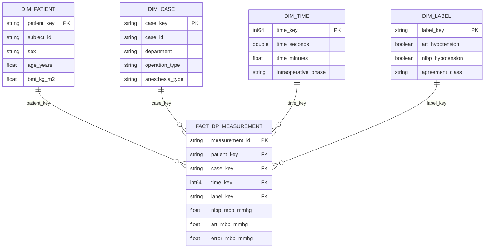

# Aula 02 — ETL, Parquet, DuckDB e esquema estrela no VitalDB

Este projeto transforma uma amostra reprodutível do **VitalDB v1.0.0**, utilizado na Aula 01, em um formato analítico. A ingestão é automática e preserva os timestamps originais das trilhas numéricas.

## Objetivo

Construir uma tabela analítica de aferições de pressão arterial não invasiva (NIBP) pareadas temporalmente à pressão arterial invasiva (ART), gravá-la em Parquet com schema explícito e compressão Zstandard, disponibilizá-la no DuckDB e responder consultas relacionadas à EDA da Aula 01.

## Fonte

- Dataset: *VitalDB, a high-fidelity multi-parameter vital signs database in surgical patients*, v1.0.0.
- PhysioNet: https://physionet.org/content/vitaldb/1.0.0/
- DOI: https://doi.org/10.13026/czw8-9p62
- API utilizada: https://api.vitaldb.net/

Os dados integrais não são redistribuídos. O script baixa automaticamente apenas os metadados e as trilhas necessárias dos oito casos definidos em `SELECTED_CASES`. A amostra mantém a primeira execução adequada a um ambiente gratuito; a lista pode ser ampliada sem alterar o pipeline.

## Execução reproduzível

Recomendação: Python 3.11 ou 3.12.

```bash
cd aula02_etl_duckdb
python3 -m venv .venv
source .venv/bin/activate
python -m pip install --upgrade pip
pip install -r requirements.txt
python src/pipeline.py
```

No Windows, a ativação é `.venv\Scripts\activate`. A primeira execução necessita de internet. As seguintes reutilizam os arquivos presentes em `data/raw/`.

O pipeline executa, em ordem:

1. download por HTTPS de `cases`, `trks` e das trilhas numéricas por `tid`;
2. conversão de tipos e tratamento de ausências;
3. pareamento temporal entre NIBP e ART;
4. construção da fato e das dimensões;
5. escrita em Parquet/Zstandard;
6. criação do banco DuckDB;
7. execução das três consultas em `sql/queries.sql`;
8. gravação dos resultados e do benchmark.

## Saídas

```text
data/processed/
├── fact_bp_measurement.parquet
├── dim_patient.parquet
├── dim_case.parquet
├── dim_time.parquet
├── dim_label.parquet
├── fact_bp_measurement.csv
└── vitaldb_star.duckdb

outputs/
├── query_results.md
└── benchmark.json
```

O arquivo `metadata/schema.json` registra o schema, grão, tipos, nulabilidade e compressão.

## Schema explícito e política de nulos

- `case_id`, `subject_id` e chaves derivadas são tratados como **texto**, pois identificam entidades e não quantidades.
- Medidas fisiológicas usam `float32`; timestamps usam `float64` e a chave temporal usa `int64`.
- Ausências são armazenadas como nulos reais Arrow/Parquet.
- Strings vazias e sentinelas textuais `-1` e `999` são convertidas em nulo somente nos campos categóricos selecionados.
- Valores fisiologicamente implausíveis são convertidos em nulo conforme regras declaradas no código; não são substituídos por médias.
- A tabela fato exige NIBP média e ART média válidas; demais pressões e frequência cardíaca podem ser nulas.

## Esquema estrela



### Tabela fato e grão

**`fact_bp_measurement`: uma linha representa uma aferição real de pressão arterial média não invasiva (`NIBP_MBP`) pareada à observação de pressão arterial média invasiva (`ART_MBP`) temporalmente mais próxima, no mesmo caso, dentro de uma tolerância máxima de 30 segundos.**

A API registra repetidamente o último valor mostrado de NIBP. O pipeline conserva apenas as mudanças consecutivas de `NIBP_MBP`, tratadas como novas aferições do manguito. A fato contém as medidas NIBP/ART, frequência cardíaca, diferença temporal e erros `NIBP − ART`. O identificador `measurement_id` é único.

### Dimensões

| Dimensão | Conteúdo |
|---|---|
| `dim_patient` | Identificador anonimizado, sexo, idade, altura, peso e IMC. |
| `dim_case` | Caso cirúrgico, departamento, tipo de operação, abordagem, posição, anestesia, ASA e emergência. |
| `dim_time` | Tempo relativo em segundos/minutos e fase intraoperatória. Não há data civil, removida por anonimização. |
| `dim_label` | Hipotensão pela ART, hipotensão pela NIBP e concordância/discordância entre os rótulos. É a dimensão extra recomendada no enunciado. |

## O que não entra no Parquet analítico

- formas de onda brutas de alta frequência, como ECG, PPG e onda arterial;
- arquivos binários `.vital` completos;
- arquivos DICOM, áudio ou imagens — não existem na parcela utilizada deste dataset;
- variáveis clínicas não utilizadas no modelo dimensional;
- datas absolutas ou identificadores pessoais, que não são disponibilizados pelo VitalDB;
- aferições sem NIBP média ou sem ART média pareável dentro da tolerância.

Excluir sinais brutos mantém o produto analítico pequeno e adequado a consultas SQL. Eles continuariam na camada de dados brutos de um data lake, caso fossem necessários em outro estudo.

## Consultas reproduzíveis

As consultas completas estão em `sql/queries.sql` e seus resultados em `outputs/query_results.md`:

1. número de aferições, casos e pacientes;
2. média de idade, viés e MAE da PAM por sexo;
3. contagem de concordância/discordância para hipotensão pela ART e NIBP.

Exemplo de consulta direta no Parquet:

```python
import duckdb

resultado = duckdb.sql("""
    SELECT COUNT(*) AS numero_medicoes,
           COUNT(DISTINCT case_key) AS numero_casos
    FROM read_parquet('data/processed/fact_bp_measurement.parquet')
""").df()
print(resultado)
```

## CSV × Parquet e tempo de consulta

O pipeline grava a tabela fato tanto em CSV quanto em Parquet, compara os tamanhos e cronometra as três consultas. Os valores observados ficam em `outputs/benchmark.json`. O Parquet utiliza compressão `zstd` e estatísticas por coluna.

Nesta amostra muito pequena, o Parquet pode ficar maior que o CSV porque incorpora schema, metadados e estatísticas. Isso não é falha: o ganho do formato está também na tipagem, leitura colunar, compressão seletiva e desempenho analítico. A vantagem de tamanho tende a aparecer com volumes maiores.

## Validações e limitações

- IDs tipados como texto e chaves não nulas.
- PKs das dimensões sem duplicidade.
- Pareamento apenas dentro do mesmo caso.
- Tolerância temporal declarada de 30 segundos para ART e 10 segundos para outras medidas NIBP.
- O pareamento observacional não equivale a validação formal conforme ISO 81060-2.
- A amostra é pequena e determinística, adequada à demonstração de engenharia de dados, não a conclusões clínicas.
- O acesso depende da disponibilidade da API externa na primeira execução.

## Estrutura do projeto

```text
aula02_etl_duckdb/
├── README.md
├── requirements.txt
├── metadata/schema.json
├── sql/queries.sql
├── src/pipeline.py
├── data/raw/
├── data/processed/
└── outputs/
```
