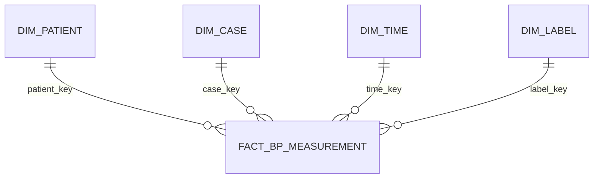

# Aula 03 — SQL Analítico, Modelagem Dimensional e Qualidade de Dados

Checkpoint I aplicado ao mesmo recorte do **VitalDB v1.0.0** utilizado nas Aulas 01 e 02. O projeto executa consultas SQL/DuckDB sobre os Parquets da Aula 02, mede duplicidade, nulidade, completude, validade e integridade dimensional, registra os resultados e organiza opcionalmente as saídas em camadas Medallion.

## Fonte e escopo

- Dataset: *VitalDB, a high-fidelity multi-parameter vital signs database in surgical patients*, v1.0.0.
- PhysioNet: https://physionet.org/content/vitaldb/1.0.0/
- DOI: https://doi.org/10.13026/czw8-9p62
- API usada na Aula 02: https://api.vitaldb.net/

Os cinco Parquets em `data/bronze/` são as saídas analíticas da Aula 02 e acompanham esta entrega. Assim, os testes da Aula 03 podem ser executados sem novo download e sem intervenção manual.

## Execução reproduzível

Recomendação: Python 3.11 ou 3.12. No Terminal do macOS:

```bash
cd aula03_qualidade_sql
python3 -m venv .venv
source .venv/bin/activate
python -m pip install --upgrade pip
pip install -r requirements.txt
python src/run_quality_checks.py
```

O script lê `sql/quality_checks.sql`, executa todas as consultas, grava os resultados em Markdown/JSON e recria as camadas Silver e Gold. Não é necessário editar caminhos.

Também é possível usar o shell do DuckDB a partir da raiz do projeto:

```bash
duckdb < sql/quality_checks.sql
```

## Verificações realizadas

1. duplicatas completas, identificadores repetidos e duplicidade no grão;
2. nulos e percentual de completude por campo;
3. sentinelas (`-1`, `999` e texto vazio) em identificadores;
4. faixas fisiológicas declaradas para NIBP, ART e frequência cardíaca;
5. coerência `SBP >= MBP >= DBP`;
6. consistência do erro `NIBP_MBP − ART_MBP`;
7. tolerância temporal do pareamento, de até 30 segundos;
8. unicidade das chaves dimensionais e integridade referencial;
9. consistência dos rótulos de hipotensão e concordância.

As regras são de controle de qualidade deste produto analítico e não constituem validação clínica formal de um equipamento.

## Modelo dimensional



### Tabela fato e grão

**`fact_bp_measurement`: uma linha representa uma nova aferição de pressão arterial não invasiva, identificada por mudança do valor de `NIBP_MBP`, pareada à observação de pressão arterial invasiva temporalmente mais próxima no mesmo caso, com tolerância máxima de 30 segundos.**

A fato contém as medidas NIBP e ART, frequência cardíaca, distância temporal do pareamento e erros `NIBP − ART`. `measurement_id` identifica unicamente a aferição.

### Dimensões

| Dimensão | Conteúdo e papel |
|---|---|
| `dim_patient` | Paciente anonimizado, sexo, idade, altura, peso e IMC. |
| `dim_case` | Caso cirúrgico, departamento, operação, abordagem, posição, anestesia, ASA e emergência. |
| `dim_time` | Tempo relativo desde o início do caso e fase intraoperatória. |
| `dim_label` | Hipotensão pela ART, hipotensão pela NIBP e concordância entre classificações. |

### Normalização e desnormalização

- Dados de paciente e do caso foram normalizados em dimensões para evitar repetição a cada aferição.
- Tempo e rótulo também foram separados para permitir agrupamentos consistentes e preservar a estrutura estrela.
- Medidas fisiológicas e erros permanecem desnormalizados na fato porque pertencem ao mesmo evento e são consultados conjuntamente.
- `patient_key`, `case_key`, `time_key` e `label_key` permanecem na fato como chaves estrangeiras.
- O horário é relativo ao procedimento; datas civis não existem no recorte anonimizado.
- Formas de onda brutas, arquivos `.vital`, ECG/PPG e sinais de alta frequência não entram no Parquet analítico.

## Organização Medallion — extensão opcional implementada

| Camada | Conteúdo |
|---|---|
| Bronze | Cinco Parquets originais produzidos na Aula 02. |
| Silver | Fato aprovada pelas regras críticas e arquivo de quarentena. |
| Gold | Métricas de completude e de valores inválidos prontas para análise. |

Os dados não são silenciosamente excluídos: qualquer registro que viole uma regra crítica é preservado na quarentena com motivo. Nulos permitidos em campos opcionais não geram quarentena.

## Principais resultados observados

- **30 aferições**, **7 casos** e **7 pacientes**.
- **0 duplicatas** completas, de `measurement_id` ou do grão analítico.
- **0 chaves estrangeiras órfãs** e **0 chaves primárias dimensionais duplicadas**.
- Completude de **100%** para identificadores, NIBP, ART média, frequência cardíaca, pareamento temporal e erro da pressão média.
- `art_sbp_mmhg`, `art_dbp_mmhg`, `error_sbp_mmhg` e `error_dbp_mmhg` têm **1 nulo cada**, portanto **96,67% de completude**.
- **0 valores fora das faixas declaradas**, **0 sentinelas** e **0 violações** da ordem sistólica–média–diastólica.
- **30 registros válidos** e **0 registros em quarentena** segundo as regras críticas.

Os resultados completos, juntamente com as próprias consultas, estão em `outputs/quality_results.md` e são regenerados pelo script.

## Decisões de tratamento

| Achado | Decisão | Justificativa |
|---|---|---|
| Um registro sem ART sistólica e diastólica | Manter com ressalva | ART média e NIBP média, necessárias à pergunta principal, estão presentes e válidas. |
| Erros sistólico e diastólico nulos no mesmo registro | Manter como nulo verdadeiro | São derivados das pressões laterais ausentes; imputá-los criaria informação artificial. |
| Violação de chave, faixa, grão, ordem das pressões ou medida central obrigatória | Colocar em quarentena | Poderia alterar métricas ou impedir junções confiáveis. Nenhum caso foi encontrado nesta amostra. |
| Valor válido | Manter sem alteração | Preserva rastreabilidade e evita tratamento desnecessário. |

## Limitações

- A amostra é determinística, porém muito pequena: 30 aferições oriundas de 7 casos; não sustenta generalização clínica.
- O caso 547 da seleção original não produziu aferição pareada válida na saída final da Aula 02.
- Os limites fisiológicos são regras operacionais amplas, não critérios diagnósticos nem validação conforme ISO 81060-2.
- A ausência das pressões ART sistólica e diastólica em um registro impede avaliar os respectivos erros, embora permita analisar a PAM.
- Os dados provêm de pacientes cirúrgicos de uma única base; há limitação de seleção e de representatividade.
- O tempo é relativo e não permite análises por data civil, dia da semana ou sazonalidade.
- Sinais brutos foram excluídos; não é possível auditar morfologia de onda neste produto tabular.

## Estrutura

```text
aula03_qualidade_sql/
├── README.md
├── requirements.txt
├── metadata/schema_aula02.json
├── sql/quality_checks.sql
├── src/run_quality_checks.py
├── data/
│   ├── bronze/   # Parquets da Aula 02
│   ├── silver/   # válidos e quarentena, gerados pelo script
│   └── gold/     # métricas de qualidade em Parquet
└── outputs/
    ├── quality_results.md
    ├── quality_results.json
    └── relatorio_qualidade.md
```

## Como interpretar a entrega

O controle encontrou boa consistência estrutural no recorte: não houve duplicatas, violações de faixa ou problemas de integridade dimensional. A única incompletude foi localizada em campos opcionais de pressão sistólica/diastólica invasiva e em seus erros derivados. Esses nulos foram preservados, pois a imputação não seria justificável e a análise principal de pressão arterial média continua possível.
